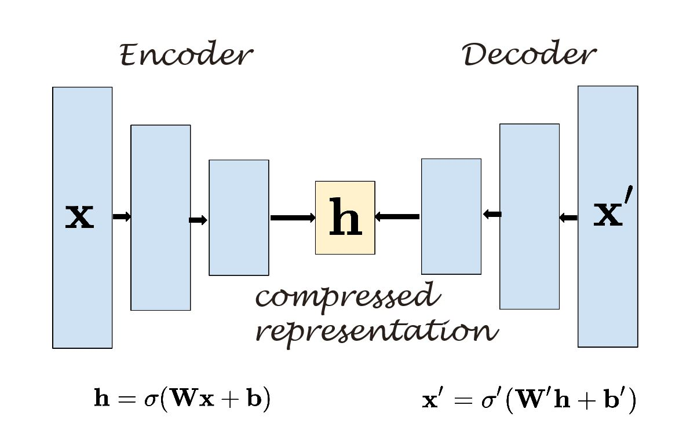

# AutoEncoders

In This Repository i will try to give you everything you need to know about AutoEncoders and how can we build an AutoEncoder in both Keras and PyTorch .

## Introduction :

AutoEncoder is a unsupervised learning Algorithm used typically for dimensionality reduction (data compression ), AutoEncoder is a Neural Network with a specific Architecture like bellow :
 
<div align="center" >

</div> 

An autoencoder has two main parts: 

* **Encoder :** that maps the input into the code (compressed representation). 
* **Decoder :** that maps the code to a reconstruction of the input.

AutoEncoder can be seen Mathematically as this :

<div align="center" >

</div>

The Goal of AutoEncoder is to Optimize the The Difference Between The Original Data x (input data) and the Reconstructed Data x_p (output data) Using a loss Function defined as bellow :

<div align="center" >

</div>

## Implementation :

1. AutoEncoder Using Keras on Mnist DataSet :

Our AutoEncoder Architecture can be seen as bellow :

<div align="center" >

</div>

The Code is represented as bellow :

```python

import matplotlib.pyplot as plt
from keras.datasets import mnist
from keras.layers import Input, Dense
from keras.models import Model 


# Loading The Data
(x_train, _), (x_test, _) = mnist.load_data()

# PreProcess The Data
def pre_process(X):
    X = X/255.0
    X = X.reshape((len(X), 784))
    return X

x_train  =  pre_process(x_train)
x_test  =  pre_process(x_test)

# Function to Display The Data 
def display_data(data , height, width, title):
    plt.figure(figsize=(10, 2))
    for i in range(10):
        ax = plt.subplot(1,10,i+1)
        plt.imshow(data[i].reshape((height,width)))
        plt.gray()        
    plt.suptitle(title)

# Our AutoEncoder 

def AutoEncoder():
    
    # Input Layer
    input_layer = Input(shape=(784,), name="input_layer")
    
    # encoder
    h_1 = Dense(256, activation='relu', name="hidden_layer_1")(input_layer)
    h_2 = Dense(128, activation='relu', name="hidden_layer_2")(h_1)
    h_3 = Dense(64, activation='relu', name="hidden_layer_3")(h_2)
    h_4 = Dense(32, activation='relu', name="hidden_layer_4")(h_3)
    h_5 = Dense(16, activation='relu', name="hidden_layer_5")(h_4)
    h_6 = Dense(8, activation='relu', name="hidden_layer_6")(h_5)
    
    # code layer
    code_layer = Dense(4, activation='relu', name="code_layer")(h_6)
    
    # decoder
    h_7 = Dense(8, activation='relu', name="hidden_layer_7")(code_layer)
    h_8 = Dense(16, activation='relu', name="hidden_layer_8")(h_7)
    h_9 = Dense(32, activation='relu', name="hidden_layer_9")(h_8)
    h_10 = Dense(64, activation='relu', name="hidden_layer_10")(h_9)
    h_11 = Dense(128, activation='relu', name="hidden_layer_11")(h_10)
    h_12 = Dense(256, activation='relu', name="hidden_layer_12")(h_11)
    
    # Output Layer
    output_layer = Dense(784, activation='sigmoid', name="output_layer")(h_12)
    
    model = Model(input_layer, output_layer)
    model.compile(optimizer='adam', loss='binary_crossentropy')
    model.summary()
    
    return model


# Training The Model
Auto_Encoder = AutoEncoder()
Auto_Encoder.fit(x_train, x_train, epochs=20)    

# Get The Decoded Data (The Final Output)
decoded_data = Auto_Encoder.predict(x_test)

# Get The Encoder Part of The Model 
encoder = Model(inputs=Auto_Encoder.input, outputs=Auto_Encoder.get_layer("code_layer").output)

# get The Encoded Data (compressed representation of size 2*2)
encoded_data = encoder.predict(x_test)

# Display The Final Result
display_data(x_test, height=28, width=28 , title="original data")
display_data(encoded_data, height=8, width=8, title="encoded data")
display_data(decoded_data, height=28, width=28 , title="decoded data")

```

Our AutoEncoder gives us this Result :

<div align="center" >

</div>

<div align="center" >

</div>

<div align="center" >

</div>

