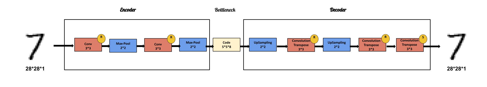

# AutoEncoders

In This Repository i will try to give you everything you need to know about AutoEncoders and how can we build an AutoEncoder in both Keras and PyTorch .

## Introduction :

AutoEncoder is an unsupervised learning Algorithm used typically for dimensionality reduction (data compression), AutoEncoder is a Neural Network with a specific Architecture like bellow :
 
<div align="center" >

</div> 

An autoencoder has two main parts: 

* **Encoder :** that maps the input into the code (compressed representation). 
* **Decoder :** that maps the code to a reconstruction of the input.

AutoEncoder can be seen Mathematically as this :

<div align="center" >

</div>

The Goal of The AutoEncoder is to Optimize the The Difference Between The Original Data x (input data) and the Reconstructed Data x_p (output data) Using a loss Function defined as bellow :

<div align="center" >

</div>

## Implementation :

**I. AutoEncoder Using Keras on Mnist DataSet .**

Our AutoEncoder Architecture can be seen as below :

<div align="center" >

</div>

The Code is represented as bellow :

```python

import matplotlib.pyplot as plt
from keras.datasets import mnist
from keras.layers import Input, Dense
from keras.models import Model 


# Loading The Data
(x_train, _), (x_test, _) = mnist.load_data()

# PreProcess The Data
def pre_process(X):
    X = X/255.0
    X = X.reshape((len(X), 784))
    return X

x_train  =  pre_process(x_train)
x_test  =  pre_process(x_test)

# Function to Display The Data 
def display_data(data , height, width, title):
    plt.figure(figsize=(10, 2))
    for i in range(10):
        ax = plt.subplot(1,10,i+1)
        plt.imshow(data[i].reshape((height,width)))
        plt.gray()        
    plt.suptitle(title)

# Our AutoEncoder 

def AutoEncoder():
    
    # Input Layer
    input_layer = Input(shape=(784,), name="input_layer")
    
    # encoder
    h_1 = Dense(256, activation='relu', name="hidden_layer_1")(input_layer)
    h_2 = Dense(128, activation='relu', name="hidden_layer_2")(h_1)
    h_3 = Dense(64, activation='relu', name="hidden_layer_3")(h_2)
    h_4 = Dense(32, activation='relu', name="hidden_layer_4")(h_3)
    h_5 = Dense(16, activation='relu', name="hidden_layer_5")(h_4)
    h_6 = Dense(8, activation='relu', name="hidden_layer_6")(h_5)
    
    # code layer
    code_layer = Dense(4, activation='relu', name="code_layer")(h_6)
    
    # decoder
    h_7 = Dense(8, activation='relu', name="hidden_layer_7")(code_layer)
    h_8 = Dense(16, activation='relu', name="hidden_layer_8")(h_7)
    h_9 = Dense(32, activation='relu', name="hidden_layer_9")(h_8)
    h_10 = Dense(64, activation='relu', name="hidden_layer_10")(h_9)
    h_11 = Dense(128, activation='relu', name="hidden_layer_11")(h_10)
    h_12 = Dense(256, activation='relu', name="hidden_layer_12")(h_11)
    
    # Output Layer
    output_layer = Dense(784, activation='sigmoid', name="output_layer")(h_12)
    
    model = Model(input_layer, output_layer)
    model.compile(optimizer='adam', loss='binary_crossentropy')
    model.summary()
    
    return model


# Training The Model
Auto_Encoder = AutoEncoder()
Auto_Encoder.fit(x_train, x_train, epochs=20)    

# Get The Decoded Data (The Final Output)
decoded_data = Auto_Encoder.predict(x_test)

# Get The Encoder Part of The Model 
encoder = Model(inputs=Auto_Encoder.input, outputs=Auto_Encoder.get_layer("code_layer").output)

# get The Encoded Data (compressed representation of size 2*2)
encoded_data = encoder.predict(x_test)

# Display The Final Result
display_data(x_test, height=28, width=28 , title="original data")
display_data(encoded_data, height=8, width=8, title="encoded data")
display_data(decoded_data, height=28, width=28 , title="decoded data")

```

Our AutoEncoder gives us this Result :

<div align="center" >

</div>

<div align="center" >

</div>

<div align="center" >

</div>

**II. Convolution AutoEncoder Using Keras on Mnist DataSet .**

Our Convolution AutoEncoder Architecture can be seen as below :


<div align="center" >

</div>

The Code Is Represented as below :

```python
import matplotlib.pyplot as plt
from keras.datasets import mnist
from keras.layers import Input, Conv2D, MaxPooling2D, UpSampling2D, Conv2DTranspose
from keras.models import Model

# Get The Data
(x_train , _) , (x_test , _ ) = mnist.load_data()

# Reshape The Data
x_train = x_train.reshape(x_train.shape[0] , x_train.shape[1] , x_train.shape[2] , 1)
x_test = x_test.reshape(x_test.shape[0] , x_test.shape[1] , x_test.shape[2] , 1)

# Standarize The Data
x_train = x_train / 255
x_test  = x_test / 255

# Function to display The Data

def display_data(data , height, width, title):
    plt.figure(figsize=(10, 2))
    for i in range(10):
        plt.subplot(1,10,i+1)
        plt.imshow(data[i].reshape((height,width)))
        plt.gray()        
    plt.suptitle(title)
    
# Our Convolution AutoEncoder    
def Conv_AutoEncoder() :
    #Input Layer
    input_layer = Input(shape=(28, 28, 1), name="input_layer")
    # Encoder    
    x = Conv2D(16, (3, 3), activation='relu')(input_layer)
    x = MaxPooling2D((2, 2) , strides=(2,2))(x)
    x = Conv2D(8, (3, 3), activation='relu')(x)
    x = MaxPooling2D((2, 2) , strides=(2,2) , name = 'code_layer')(x)
    # Code
    code = x
    # Decoder
    x = UpSampling2D((2, 2))(code)
    x = Conv2DTranspose(8, (3, 3), activation='relu')(x)
    x = UpSampling2D((2, 2) )(x)
    x = Conv2DTranspose(16, (3, 3), activation='relu')(x)
    # Output Layer
    output_layer = Conv2DTranspose(1, (3, 3), activation='sigmoid')(x)
    
    conv_Autoencoder = Model(input_layer , output_layer)
    
    return conv_Autoencoder
    
# Compiling The Model

Convolution_AutoEncoder = Conv_AutoEncoder()
Convolution_AutoEncoder.compile(optimizer='adam', loss='mse')
Convolution_AutoEncoder.summary()

# Training The Model
Convolution_AutoEncoder.fit(x_train , x_train , epochs=10 , batch_size=32 , shuffle=True , validation_data=(x_test , x_test))

# get The Decoded Data
decoded_data = Convolution_AutoEncoder.predict(x_test)

Encoder = Model(inputs = Convolution_AutoEncoder.input , outputs = Convolution_AutoEncoder.get_layer("code_layer").output)

# get The Encoded Data
encoded_data = Encoder.predict(x_test)

# display The Result

display_data(x_test , height = 28 , width = 28 , title = 'Original Data')
display_data(encoded_data , height = 5 , width = 5*8 , title = 'Encoded Data')
display_data(decoded_data , height = 28 , width = 28 , title = 'Decoded Data')    

```

Our Convolution AutoEncoder gives us this Result :

<div align="center" >

</div>

**III. AutoEncoder Using PyTorch on Mnist DataSet .**

Our AutoEncoder Architecture can be seen as below :

<div align="center" >

</div>

The Code is represented as below :

```python
import torch
import torch.nn as nn
import torch.optim as optim
from torchvision import datasets, transforms
import matplotlib.pyplot as plt

# Loading The DataSet
train_data = datasets.MNIST(
    root = 'data',
    train = True,                         
    transform = transforms.ToTensor(), 
    download = True,            
)

train_data_loader = torch.utils.data.DataLoader(dataset=train_data,batch_size=64,shuffle=True)

# Defining our AutoEncoder Architecture 
class Autoencoder(nn.Module):
    def __init__(self):
        super(Autoencoder , self).__init__()        
        
        # Encoder
        self.encoder = nn.Sequential(
            nn.Linear(784, 256),
            nn.ReLU(),
            nn.Linear(256, 128),
            nn.ReLU(),
            nn.Linear(128, 32),
            nn.ReLU(),
            nn.Linear(32, 16) ,
            nn.ReLU(),
            nn.Linear(16, 10)
        )
        
        # Decoder
        self.decoder = nn.Sequential(
            nn.Linear(10, 16),
            nn.ReLU(),
            nn.Linear(16, 32),
            nn.ReLU(),
            nn.Linear(32, 64),
            nn.ReLU(),
            nn.Linear(64, 128),
            nn.ReLU(),
            nn.Linear(128, 256),
            nn.ReLU(),
            nn.Linear(256, 784),
            nn.Sigmoid()
        )

    def forward(self, x):
        encoded_data = self.encoder(x)
        decoded_data = self.decoder(encoded_data)
        return decoded_data

# Training The Model 

model = Autoencoder()
loss_function = nn.MSELoss()
optimizer = torch.optim.Adam(model.parameters(),lr=1e-3,weight_decay=1e-5)

number_of_epochs = 10
results = []
for epoch in range(number_of_epochs):
    for (img, _) in train_data_loader:
        img = img.reshape(-1 , 784) 
        reconstructed_image = model(img)
        loss = loss_function(reconstructed_image, img)
        
        optimizer.zero_grad()
        loss.backward()
        optimizer.step()

    print(f'Epoch : {epoch+1} , Loss : {loss.item()} ')
    results.append((epoch, img, reconstructed_image))

# Visualize The Result 

def plot_result(autoEncoder_result , nbr_epoch):
    original_images = autoEncoder_result[ nbr_epoch -1 ][1].detach().numpy()
    reconstructed_images = autoEncoder_result[ nbr_epoch -1 ][2].detach().numpy()

    # Plot The Original Images 
    plt.figure(figsize=(9, 3))
    plt.gray()
    for index, image in zip(range(9) , original_images):
            plt.subplot(2, 9, index+1)
            image = image.reshape(-1, 28,28)
            plt.imshow(image[0])
    plt.suptitle(f"Original Images " , fontsize = 20) 

    # Plot The Reconstructed images
    plt.figure(figsize=(9, 3))
    plt.gray()
    for index, image in zip(range(9), reconstructed_images):
        plt.subplot(2, 9, index+1)
        image = image.reshape(-1, 28,28) 
        plt.imshow(image[0])        
    plt.suptitle(" Reconstructed Images" , fontsize = 20)   

plot_result(results , number_of_epochs)

```
Our AutoEncoder gives us this Result :

<div align="center" >

</div>

**IV. Convolution AutoEncoder Using PyTorch on Mnist DataSet .**

Our Convolution AutoEncoder Architecture can be seen as bellow :

<div align="center" >

</div>

The Code is represented as below :

```python
import torch
import torch.nn as nn
import torch.optim as optim
from torchvision import datasets, transforms
from torchsummary import summary
from torch.autograd import Variable
import matplotlib.pyplot as plt


# Loading The Dataset and Creating The Data Loader to iterate Over The Data
train_data = datasets.MNIST(
    root = 'data',
    train = True,                         
    transform = transforms.ToTensor(), 
    download = True,            
)

train_data_loader = torch.utils.data.DataLoader(dataset=train_data,batch_size=64,shuffle=True)

# defining our Convolution Autoencoder Architecture

class Convolution_Autoencoder(nn.Module):
    def __init__(self):
        super(Convolution_Autoencoder , self).__init__()        
        
        # Encoder
        self.encoder = nn.Sequential(
            nn.Conv2d(1, 16, 3 , padding=1), 
            nn.ReLU(),
            nn.MaxPool2d(kernel_size=(2,2) , stride=(2,2)),
            nn.Conv2d(16, 32, 3, stride=1), 
            nn.ReLU(),
            nn.MaxPool2d(kernel_size=(2,2) , stride=(2,2)),
            nn.Conv2d(32, 64, 6) 
        )
        
        # Decoder
        self.decoder = nn.Sequential(
            nn.ConvTranspose2d(64, 32, 7), 
            nn.ReLU(),
            nn.ConvTranspose2d(32, 16, 3, stride=2, padding=1, output_padding=1), 
            nn.ReLU(),
            nn.ConvTranspose2d(16, 1, 3, stride=2, padding=1, output_padding=1), 
            nn.Sigmoid()
        )

    def forward(self, x):
        encoded_data = self.encoder(x)
        decoded_data = self.decoder(encoded_data)
        return decoded_data
    
# visualizing The Architecture
model = Convolution_Autoencoder().cuda()
summary(model , (1 , 28 , 28))
loss_function = nn.MSELoss()
optimizer = torch.optim.Adam(model.parameters(),lr=1e-3,weight_decay=1e-5)

# Training The Model
number_of_epochs = 10
results = []
for epoch in range(number_of_epochs):
    for (img, _) in train_data_loader:
        #img = img.reshape(-1 , 784) 
        img = Variable(img).cuda()
        reconstructed_image = model(img)
        loss = loss_function(reconstructed_image, img)
        
        optimizer.zero_grad()
        loss.backward()
        optimizer.step()

    print(f'Epoch:{epoch+1}, Loss:{loss.item():.4f}')
    results.append((epoch, img, reconstructed_image))

# Visualizing The Result
def plot_result(autoEncoder_result , nbr_epoch):
    original_images = autoEncoder_result[ nbr_epoch -1 ][1].cpu().data.numpy()
    reconstructed_images = autoEncoder_result[ nbr_epoch -1 ][2].cpu().data.numpy()

    # Plot The Original Images 
    plt.figure(figsize=(9, 3))
    plt.gray()
    for index, image in zip(range(9) , original_images):
            plt.subplot(2, 9, index+1)
            image = image.reshape(-1, 28,28)
            plt.imshow(image[0])
    plt.suptitle(f"Original Images " , fontsize = 20) 

    # Plot The Reconstructed images
    plt.figure(figsize=(9, 3))
    plt.gray()
    for index, image in zip(range(9), reconstructed_images):
        plt.subplot(2, 9, index+1)
        image = image.reshape(-1, 28,28) 
        plt.imshow(image[0])        
    plt.suptitle(" Reconstructed Images" , fontsize = 20)   

plot_result(results , number_of_epochs)
```

Our AutoEncoder gives us this Result :

<div align="center" >

</div>

## References :
* [Reducing the dimensionality of data with neural networks By Geoffrey Hinton](https://citeseerx.ist.psu.edu/viewdoc/download?doi=10.1.1.459.3788&rep=rep1&type=pdf)
* [Autoencoder By Wikipedia](https://en.wikipedia.org/wiki/Autoencoder)
* [Pytorch Documentation](https://pytorch.org/)
* [keras Documentation](https://keras.io/)